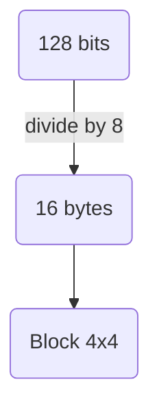

# AES: Advanced Encryption Standard

AES is a non-Feistel cipher that encrypts and decrypts a data block . It uses 10, 12, or 14 rounds depending on the key size, which can be 128, 192, or 256 bits.

It is a symmetric block *cipher* , which means a single key will encrypt and decrypt all the data.


# Block Cipher:

Block refers to the way in which the stuff you're encoding (the *plaintext*) is turned into the *ciphertext* . Cipher refers to any algorithm for encryption. A block cipher operates on multiple bytes of plaintext at the same time, arranged into a 2D block.

For AES the block size will be **128 bits** but the cipher key size can be different (128, 192 or 256) - for *AES-128*, *AES-192*, and *AES-256* respectively.

# The State:



```python
def arraytomatrix(self, array): # array is bytes array.
    return [list(array[i:i+4] )for i in range(0, len(array), 4)]
```

The AES will simple take the input bytes make it into block 4 by 4 and apply the encryption algorithm.

Input Bytes:

| a0 | a4 | a8 | a12 |
| --- | --- | --- | --- |
| a1 | a5 | a9 | a13 |
| a2 | a6 | a10 | a14 |
| a3 | a7 | a11 | a15 |

State Matrix

| s0,0 | s0,1 | s0,2 | s0,3 |  |
| --- | --- | --- | --- | --- |
| s1,0 | s1,1 | s1,2 | s1,3 |  |
| s2,0 | s2,1 | s2,2 | s2,3 |  |
| s3,0 | s3,1 | s3,2 | s3,3 |  |

Output - Cipher Text

| out0 | out4 | out8 | out12 |
| --- | --- | --- | --- |
| out1 | out5 | out9 | out13 |
| out2 | out6 | out10 | out14 |
| out3 | out7 | out11 | out15 |

# Prerequisites:

 We need to learn about [finite field arithmetic](https://en.wikipedia.org/wiki/Finite_field_arithmetic) for some (3) operations in AES: *Mix Column*, *Add Round Keys*, and *Key Schedule*. 

## Finite Field - Galois Field:

A **Field** is a [**Group**](https://en.wikipedia.org/wiki/Group_theory) which satisfied both addition and multiplication with some properties:

- F is an abelian group under addition
- F - {0}  ( the set F without the additive identity 0) is an abelian group under multiplication

Finite Field is a field with finite element:

- If $Z/nZ$   with n is not a prime, then it is not a field because $(Z/nZ -\{0\}) \neq (Z/nZ)^{\times}$ . There exist a number with does not relatively prime to n so there is no inverse under multiplication.

All finite fields have $p^n$ elements where $p$ is prime and $n$ is an integer at least 1. The field with $p^n$ elements is sometimes called the **Galois Field** - GF$(p^n)$.

The Galois fields of order GF$(p)$ are simple integer mod p. If $n>1$, the elements of GF$(p^n)$ are **polynomials** of degree $n-1$ with coefficients from GF$(p)$.

In AES,  for some transformation, each byte in the state array is interpreted as one of the 256 elements of GF($2^8$).

In order to define addition and multiplication in GF($2^8$), each bytes $\{b_7 \; b_6 \; b_5 \; b_4 \; b_3 \; b_2 \; b_1 \; b_0 \}$ is interpreted as a polynomial:

$$
b(x) = b_7x^7+b_6x^6+b_5x^5+b_4x^4+b_3x^3+b_2x^2+b_1x+b_0
$$

## Addition in GF($2^8$):

Because $\{b_7 \; b_6 \; b_5 \; b_4 \; b_3 \; b_2 \; b_1 \; b_0 \}$ is from GF(2), the addition of each elements can be seen as exclusive-OR (XOR) operation:

| x | y | x ⊕ y |
| --- | --- | --- |
| 1 | 1 | 0 |
| 1 | 0 | 1 |
| 0 | 1 | 1 |
| 0 | 0 | 0 |

Because the coefficients of the polynomials are reduced modulo 2, the coefficient 1 is equivalent to the coefficients –1:

$$
\begin{aligned}
&(x^6 + x^4 + x^2 + x + 1) + (x^7 + x + 1) = x^7 + x^6 + x^4 + x^2 \\
&\{0101011\} \oplus \{10000011\} = \{11010100\} \\
&\{57\} \oplus \{83\} = \{d4\}
\end{aligned}
$$

## Multiplication in GF($2^8$):

We will define the multiplication in GF($2^8$) to be the ordinary polynomial product except we will take the reminder after dividing with [**irreducible polynomial**](https://matthewvaneerde.wordpress.com/2014/02/01/sieving-irreducible-monic-polynomials-over-a-finite-field/) **m(x)** of degree 8:

$$
m(x) = x^8+x^4+x^3+x+1
$$

So if we have $b(x)$ and $c(x)$ represent bytes *b* and *c.* Then $b \times c$ is represented by:

$$
b(x)c(x) \; mod \; m(x)
$$

Example: Let b = $0x57$ and c= $0x83$ so

$$
\begin{aligned}b(x) &= x^6+x^4+x^2+x+1 \\ c(x) &= x^7+x+1 \end{aligned}
$$

Multiply these polynomials:

$$
\begin{aligned} b(x) \cdot c(x) &= (x^6+x^4+x^2+x+1)(x^7+x+1) \\&= x^{13} +x^{11} +x^9+x^7+x^6+x^5+x^4+x^3+x^2+x+1 \end{aligned}
$$

Note:

- For the $x$ with have power more than 8, we just divide the polynomial with $m(x)$ until it do not have any.

 After reduction and combination:

$$
x^{13} +x^{11} +x^9+x^7+x^6+x^5+x^4+x^3+x^2+x+1 \; mod(m(x)) \\ = x^7+x^6+1
$$

So $b\times c$ is equal to $\{0xC1\}$. There is also a faster way to do it as describe in this [article](https://matthewvaneerde.wordpress.com/2014/03/18/efficient-multiplication-and-division-in-gf2/) .

## xTime:

In AES, To calculate the multiplication faster, we using the same idea as [binary exponentiation](https://cp-algorithms.com/algebra/binary-exp.html) - which means present the pow number in binary form and begin double and add sequence.

The function xTime is used to multiply number with $x$ or in hex $0x02$ in GF($2^8$).

$$
\text{xTime(b)} = \begin{cases}
\{ b_6 \, b_5 \, b_4 \, b_3 \, b_2 \, b_1 \, b_0 \, 0 \} \quad \quad \quad \text{if} \; b_7 = 0.\\
\{ b_6 \, b_5 \, b_4 \, b_3 \, b_2 \, b_1 \, b_0 \, 0 \}\; \oplus \; \{0\, 0\, 0\, 1\, 1\, 0\, 1\, 1\, \} \quad \text{if} \; b_7 = 1
 \end{cases}
$$

Which can be present in python as lambda function:

```python
xtime = lambda a: (((a << 1) ^ 0x1B) & 0xFF) if (a & 0x80) else (a << 1)
```

# Operation:

For each key length bits, the number of rounds in AES is different:

|  | Key Length | Number of rounds (N) |
| --- | --- | --- |
| AES-128 | 128                  | 10 |
| AES-196 | 196 | 12 |
| AES-256 | 256 | 14 |

The AES consists of 5 operations:

- Substitute Bytes - Sub-Bytes:
- Shift Rows:
- Mix Columns:
- Add Round Key: - The original key is denote as K, and the round keys will be denoted as *w*.
- Key Expansion - for creating the round keys.

## Substitute Bytes:

SubBytes is an invertible, non-linear transformation of the state using a substitution (look-up) table call S-box. This tables was designed by Joan Daemen and Vincent Rijndael- the creators of AES.

Note: this S-box is carefully calculated so that it is resistant to Linear cryptanalysis.

```markdown
encrypt_state[i][j]= s_box[i][j];
state[i][j] = inverse_s_box[encrypt_state]
```

|  | 00 | 01 | 02 | 03 | 04 | 05 | 06 | 07 | 08 | 09 | 0a | 0b | 0c | 0d | 0e | 0f |
| --- | --- | --- | --- | --- | --- | --- | --- | --- | --- | --- | --- | --- | --- | --- | --- | --- |
| 00 | 63 | 7c | 77 | 7b | f2 | 6b | 6f | c5 | 30 | 01 | 67 | 2b | fe | d7 | ab | 76 |
| 10 | ca | 82 | c9 | 7d | fa | 59 | 47 | f0 | ad | d4 | a2 | af | 9c | a4 | 72 | c0 |
| 20 | b7 | fd | 93 | 26 | 36 | 3f | f7 | cc | 34 | a5 | e5 | f1 | 71 | d8 | 31 | 15 |
| 30 | 04 | c7 | 23 | c3 | 18 | 96 | 05 | 9a | 07 | 12 | 80 | e2 | eb | 27 | b2 | 75 |
| 40 | 09 | 83 | 2c | 1a | 1b | 6e | 5a | a0 | 52 | 3b | d6 | b3 | 29 | e3 | 2f | 84 |
| 50 | 53 | d1 | 00 | ed | 20 | fc | b1 | 5b | 6a | cb | be | 39 | 4a | 4c | 58 | cf |
| 60 | d0 | ef | aa | fb | 43 | 4d | 33 | 85 | 45 | f9 | 02 | 7f | 50 | 3c | 9f | a8 |
| 70 | 51 | a3 | 40 | 8f | 92 | 9d | 38 | f5 | bc | b6 | da | 21 | 10 | ff | f3 | d2 |
| 80 | cd | 0c | 13 | ec | 5f | 97 | 44 | 17 | c4 | a7 | 7e | 3d | 64 | 5d | 19 | 73 |
| 90 | 60 | 81 | 4f | dc | 22 | 2a | 90 | 88 | 46 | ee | b8 | 14 | de | 5e | 0b | db |
| a0 | e0 | 32 | 3a | 0a | 49 | 06 | 24 | 5c | c2 | d3 | ac | 62 | 91 | 95 | e4 | 79 |
| b0 | e7 | c8 | 37 | 6d | 8d | d5 | 4e | a9 | 6c | 56 | f4 | ea | 65 | 7a | ae | 08 |
| c0 | ba | 78 | 25 | 2e | 1c | a6 | b4 | c6 | e8 | dd | 74 | 1f | 4b | bd | 8b | 8a |
| d0 | 70 | 3e | b5 | 66 | 48 | 03 | f6 | 0e | 61 | 35 | 57 | b9 | 86 | c1 | 1d | 9e |
| e0 | e1 | f8 | 98 | 11 | 69 | d9 | 8e | 94 | 9b | 1e | 87 | e9 | ce | 55 | 28 | df |
| f0 | 8c | a1 | 89 | 0d | bf | e6 | 42 | 68 | 41 | 99 | 2d | 0f | b0 | 54 | bb | 16 |


When decrypting, the *inverse* s-box is used. If s-box is (state, value) so the inverse s-box is (value, state).


```python
def sub_bytes(self, state):
    for i in range(4):
        for j in range(4):
            state[i][j] = self.s_box[state[i][j]]
    return state
def inv_sub_bytes(self, state):
    for i in range(4):
        for j in range(4):
            state[i][j] = self.inv_s_box[state[i][j]]
```

## Shift Row:

Shift Row is a transformation of the state where the bytes in the last three rows are cyclically shifted.

The position by which the bytes are shifted depend on the row index *r:*

$$
s'_{r,c}=s_{r,(c+r) \; mod\; 4}
$$

In *r* row, we shift each bytes by *r* positions to the left, and cycling left-most *r* bytes around to the right end.  

Note: the first row (*r*  = 0) is unchanged.


The **inverse shift row** can be easily define by changing the direction of the shift row:

$$
s'_{r,c}=s_{r,(c-r) \; mod\; 4}
$$

```python
def shift_rows(self, state):
    state[0][1],state[1][1],state[2][1],state[3][1] = state[1][1],state[2][1],state[3][1],state[0][1]
    state[0][2],state[1][2],state[2][2],state[3][2] = state[2][2],state[3][2],state[0][2],state[1][2]
    state[0][3],state[1][3],state[2][3],state[3][3] = state[3][3],state[0][3],state[1][3],state[2][3]
    return state
def inv_shift_rows(self, state):
    state[0][1],state[1][1],state[2][1],state[3][1] = state[3][1],state[0][1],state[1][1],state[2][1]
    state[0][2],state[1][2],state[2][2],state[3][2] = state[2][2],state[3][2],state[0][2],state[1][2]
    state[0][3],state[1][3],state[2][3],state[3][3] = state[1][3],state[2][3],state[3][3],state[0][3]
    return state
```

## Mix Column:

The transformation can be expressed in terms of matrix multiplication in GF$(2^8)$.  For the matrix, each of the 16 entries of the matrix is a byte of a single word - $[a_0, a_1, a_2, a_3].$ If we were given an input  $[b_0, b_1, b_2, b_3]$ , the output  $[d_0, d_1, d_2, d_3]$ is determined as:

$$
\begin{pmatrix}
d_{0} \\ d_{1} \\
d_{2} \\ d_{3}
\end{pmatrix} = \begin{pmatrix}
a_{0} & a_{3} & a_{2} & a_{1} \\
a_{1} & a_{0} & a_{3} & a_{2} \\ 
a_{2} & a_{1} & a_{0} & a_{3} \\ 
a_{3} & a_{2} & a_{1} & a_{0} 
\end{pmatrix} * \begin{pmatrix}
b_{0} \\ b_{1} \\
b_{2}  \\ b_{3}
\end{pmatrix}\\
$$

$$d_0 = (a_0 \times b_0) \oplus (a_3 \times b_1) \oplus (a_2 \times b_2)\oplus (a_1 \times b_3)...$$ 

$$d_3 = (a_3 \times b_0) \oplus (a_2 \times b_1) \oplus (a_1 \times b_2)\oplus (a_0 \times b_3). $$

In AES the chosen word $[a_0, a_1, a_2, a_3]$ = $[\{02\}, \{01\},\{01\}, \{03\}]$, so the formula will become:

$$
\begin{pmatrix}
s_{0,c}^{'} \\ s_{1,c}^{'} \\
s_{2,c}^{'} \\ s_{3,c}^{'}
\end{pmatrix} = \begin{pmatrix}
02 & 03 & 01 & 01\\
01 & 02 & 03 & 01\\
01 & 01 & 02 & 03\\
03 & 01 & 01 & 02
\end{pmatrix} * \begin{pmatrix}
s_{0,c} \\ s_{1,c} \\
s_{2,c}  \\ s_{3,c}
\end{pmatrix} \text{with} \; 0 \leq c \leq 4. \\
$$

$$s_{0,c}^{'} = (\{02\} \times s_{0,c}) \oplus (\{03\} \times s_{1,c}) \oplus (\{01\} \times s_{2,c})\oplus (\{01\} \times s_{3,c})$$

$$s_{3,c}^{'} = (\{03\} \times s_{0,c}) \oplus (\{01\} \times s_{1,c}) \oplus (\{01\} \times s_{2,c})\oplus (\{02\} \times s_{3.c}).$$

For the **inverse mix column**, we just multiply the encrypted word with inverse transformation matrix.

```python
def mix_columns(self, state):
    for i in range(4):
        t = state[i][0] ^ state[i][1] ^ state[i][2] ^ state[i][3]
        u = state[i][0]
        state[i][0] ^= t ^ self.xtime(state[i][0] ^ state[i][1])
        state[i][1] ^= t ^ self.xtime(state[i][1] ^ state[i][2])
        state[i][2] ^= t ^ self.xtime(state[i][2] ^ state[i][3])
        state[i][3] ^= t ^ self.xtime(state[i][3] ^ u)
    return state
def inv_mix_columns(self, state):
    for i in range(4):
        u = self.xtime(self.xtime(state[i][0] ^ state[i][2]))
        v = self.xtime(self.xtime(state[i][1] ^ state[i][3]))
        state[i][0] ^= u
        state[i][1] ^= v
        state[i][2] ^= u
        state[i][3] ^= v
    state = self.mix_columns(state)
    return state
```

## Add Round Keys:

This is a transformation of the state in which a round key is combined with the
state by applying the bitwise XOR operation. A round key consists of four words from the key schedule. we denote **t** as $4*round+c$ 

$$
\begin{pmatrix}
s_{0,c}^{'} \\ s_{1,c}^{'} \\
s_{2,c}^{'} \\ s_{3,c}^{'}
\end{pmatrix} = \begin{pmatrix}
s_{0,c} \\ s_{1,c} \\
s_{2,c}  \\ s_{3,c}
\end{pmatrix} \oplus \begin{pmatrix}
w_{t0} \\ w_{t1} \\
w_{t2}  \\
w_{t3}
\end{pmatrix} \text{with} \; 0 \leq c \leq 3
$$

- Round can be 10, 12, 14 depend on the type of AES.
- $w$  is the key schedule.

Because it is using XOR operation so the **inverse of add round keys** transformation is itself. 

```python
def add_round_key(self, state):
        for i in range(4):
            for j in range(4):
                state[i][j] ^= self.round_keys[i][j]
        return state
```

## Key Expansion:

The transformation is used to make the secret key, and expanding it into series of *round keys* called the [*key schedule*](https://en.wikipedia.org/wiki/AES_key_schedule). The process of generating is different for each of AES-128, AES-192, and AES-256, but the core process is the same, so we just focus into AES-128 key expansion.


The key expansion consist of 3 sub process called: RotWord, SubWord, and Rcon. 

### RotWord:

We will rotate the bytes in the column, which was similar to ShiftRow, but we just need to rotate one byte.


### SubWord:

It is the same as SubBytes.

### Rcon - **Round constants:**

The Rcon values is define as:

$$
rcon_i  =[ rc_i \; 00_{16} \; 00_{16}\; 00_{16}] \\
r_{c_i} = 
\begin{cases} 
1 & \text{if } i = 1 \\
2 \cdot r_{c_{i-1}} & \text{if } i > 1 \text{ and } r_{c_{i-1}} < 80_{16} \\
(2 \cdot r_{c_{i-1}}) \oplus 11B_{16} & \text{if } i > 1 \text{ and } r_{c_{i-1}} \geq 80_{16}
\end{cases}
$$

So the Rcon Table will be:


The key will be present as a 4 by 4 matrix and the step of Key Expansion is as follow: Images are take from [this.](https://formaestudio.com/rijndaelinspector/archivos/Rijndael_Animation_v4_eng-html5.html)


We will take the last column, do the following RotWord → SubWord → Rcon and XOR it which the first column then it become the 1 first column of the next key round. 


The second, third, and fourth column of the block will be XORed with the first column and we will successfully build the next key round.


Repeat this process **N** times and then we will have the key expansion $w$.

```python
def rotWord(self, word):
        out = word[1:] + word[:1]
        return out
def subWord(self, word):
    out = []
    for byte in word:
        out.append(self.s_box[byte])
    return out
    
def key_expansion(self, key):
    round_keys = self.arraytomatrix(key)

    Nk = len(key) // 4

    size_of_round_keys = (self.N + 1) * 4

    i = Nk
    while len(round_keys) < size_of_round_keys:
        LastWordInBlock = round_keys[-1]

        if i % Nk == 0:
            LastWordInBlock = self.rotWord(LastWordInBlock)
            LastWordInBlock = self.subWord(LastWordInBlock)
            rcon = self.rcon[i // Nk - 1]
            LastWordInBlock[0] ^= rcon  # Only the first byte is XORed with rcon

        elif Nk > 6 and i % Nk == 4:
            LastWordInBlock = self.subWord(LastWordInBlock)

        # XOR the word with the word Nk positions earlier
        LastWordInBlock = [LastWordInBlock[j] ^ round_keys[-Nk][j] for j in range(4)]
        round_keys.append(LastWordInBlock)
        i += 1

    return round_keys
```

# Encryption:

The Pseudocode:

```java
Cipher(in,N,w):
	state = in - convert to 4x4
	// preRounds:
	state = AddRoundKey(state,w[0..3])
	// main rounds:
	for round from 1 to N-1: 
		state = SubBytes(state)
		state = ShiftRows(state)
		state = MixColumn(state)
		state = AddRoundKey(state,w[4*round .. 4*round+3])
	// last round
	state = SubBytes(state)
	state = ShiftRows(state)
	state = AddRoundKey(state,w[4*N.. 4*N+3])
	return state
```


Operation for each round:


The encryption function is just for one block - with padding.

```python
def encrypt(self, plaintext): # 16 bytes -> ciphertext output bytes
        # follow the pseudocode
        plaintext = self.pad(plaintext)
        state = self.arraytomatrix(plaintext)
        state = self.add_round_key(state)
        for round in range(1, self.N):
            state = self.sub_bytes(state)
            state = self.shift_rows(state)
            state = self.mix_columns(state)
            state = self.add_round_key(state, round)
        state = self.sub_bytes(state)
        state = self.shift_rows(state)
        state = self.add_round_key(state, self.N)
        ciphertext = self.matrixtoarray(state)
        ciphertext = bytes(ciphertext)
        return ciphertext
```

This is the code for encrypting a plaintext - with any length → using ECB mode:

```python
def encrypt_ecb(self, plaintext): # ciphertext output bytes
    ciphertext = b''
    for i in range(0,len(plaintext),16):
        block = plaintext[i:i+16]
        ciphertext += self.encrypt(block)
    return ciphertext
```

# Decryption:

The Pseudocode:

```cpp
InvCipher(in,N,w):
	state = in - convert to 4x4
	// preRounds:
	state = AddRoundKey(state,w[4*N.. 4*N+ 3])
	// main rounds:
	for round from N-1 to 1: 
		state = InvShiftRows(state)
		state = InvSubBytes(state)
		state = AddRoundKey(state,w[4*round .. 4*round+3])
		state = InvMixColumn(state)
	// last round
	state = InvShiftRows(state)
	state = InvSubBytes(state)
	state = AddRoundKey(state,w[0.. 3])
	return state
```


Operation for each round:


All the description for the inverse functions  are being presented above in Substitute Bytes, Shift Row, Mix Column, and Add Round Key respectively.

```python
def decrypt(self, ciphertext): # 16 bytes -> plaintext output bytes
    # follow the pseudocode
    cipher_state  = self.arraytomatrix(ciphertext)
    cipher_state = self.add_round_key(cipher_state, self.N)
    for i in range(self.N - 1, 0, -1):
        cipher_state = self.inv_shift_rows(cipher_state)
        cipher_state = self.inv_sub_bytes(cipher_state)
        cipher_state = self.add_round_key(cipher_state, i)
        cipher_state = self.inv_mix_columns(cipher_state)
           
        cipher_state = self.inv_shift_rows(cipher_state)
        cipher_state = self.inv_sub_bytes(cipher_state)
        cipher_state  = self.add_round_key(cipher_state , 0)
        plaintext = self.matrixtoarray(cipher_state)
        plaintext = self.unpad(plaintext)
        plaintext = bytes(plaintext)
    return plaintext
```

Code for decrypting ciphertext with any length → using ECB mode.

```python
def decrypt_ecb(self, ciphertext): # plaintext output bytes
    plaintext = b''
    for i in range(0,len(ciphertext),16):
        block = ciphertext[i:i+16]
        plaintext += self.decrypt(block)
    return plaintext
```

# **Encrypting random data:**

Some (all) the times, the data do not long (or short) enough to fit in a block - we divide the data into block of 16 bytes but there still remains some bytes off. Then the remained bytes will be padded with some random bytes - (often the number of bytes needed) - pkcs 7 to make it to 16.


# Mode:

Based on [this](https://csrc.nist.gov/Projects/block-cipher-techniques/BCM).

## ECB -**Electronic Code Book:**

The Electronic Codebook (ECB) mode is a confidentiality mode that features, for a given key,
the assignment of a fixed ciphertext block to each plaintext block, analogous to the assignment of
code words in a codebook.

- ECB encryption:  $ciphertext = AES(message)$.
- ECB decryption:  $message =$ $AES(ciphertext)$.

In both encryption and decryption, message (ciphertext) is divided into block and then directly to block cipher. 


But it contains some major vulnerabilities: ECB oracle, or more characteristic still can be observed after encryption.

## CBC -The Cipher Block Chaining Mode:

The Cipher Block Chaining (CBC) mode is a confidentiality mode whose encryption process
features the combining (“chaining”) of the plaintext blocks with the previous ciphertext blocks.
The CBC mode requires an IV to combine with the first plaintext block. IV: Initialization vector

CBC Encryption

- $ciphertext_1 = AES(message_1 \oplus IV)$
- $ciphertext_n = AES(message_n \oplus ciphertext_{n-1})$
    
    
    

CBC Decryption:

- $message_1 = AES^{-1} (ciphertext_1)\oplus IV$
- $message_{n} = AES^{-1}(ciphertext_{n}) \oplus ciphertext_{n-1}$


## CTR - The Counter Mode:

It make a block cipher become a stream cipher by generating output base on counter and then XOR with the plaintext to create ciphertext and vise versa. The sequence of counters must have the property that each block in the sequence is different from every other block.

Note: Nonce is the start of the counter → reuse nonce very dangerous because the ciphertext will XOR with the same output → can leak key. 


# Full AES implementation:

```python
from Crypto.Cipher import AES as AES_source
from Crypto.Random import get_random_bytes
from Crypto.Util.Padding import pad, unpad
from tqdm import tqdm
import os
BLOCK_SIZE = 16

class AES:
    Nr = {16: 10, 24: 12, 32: 14}
    def __init__(self, key):
        assert len(key) in self.Nr, "Key length must be 16, 24, or 32 bytes"
        self.key = key
        self.N = self.Nr[len(self.key)]
        self.round_keys = self.key_expansion(key)
        self.xtime = lambda a: (((a << 1) ^ 0x1B) & 0xFF) if (a & 0x80) else (a << 1)

    # constants
    s_box = (
    0x63, 0x7C, 0x77, 0x7B, 0xF2, 0x6B, 0x6F, 0xC5, 0x30, 0x01, 0x67, 0x2B, 0xFE, 0xD7, 0xAB, 0x76,
    0xCA, 0x82, 0xC9, 0x7D, 0xFA, 0x59, 0x47, 0xF0, 0xAD, 0xD4, 0xA2, 0xAF, 0x9C, 0xA4, 0x72, 0xC0,
    0xB7, 0xFD, 0x93, 0x26, 0x36, 0x3F, 0xF7, 0xCC, 0x34, 0xA5, 0xE5, 0xF1, 0x71, 0xD8, 0x31, 0x15,
    0x04, 0xC7, 0x23, 0xC3, 0x18, 0x96, 0x05, 0x9A, 0x07, 0x12, 0x80, 0xE2, 0xEB, 0x27, 0xB2, 0x75,
    0x09, 0x83, 0x2C, 0x1A, 0x1B, 0x6E, 0x5A, 0xA0, 0x52, 0x3B, 0xD6, 0xB3, 0x29, 0xE3, 0x2F, 0x84,
    0x53, 0xD1, 0x00, 0xED, 0x20, 0xFC, 0xB1, 0x5B, 0x6A, 0xCB, 0xBE, 0x39, 0x4A, 0x4C, 0x58, 0xCF,
    0xD0, 0xEF, 0xAA, 0xFB, 0x43, 0x4D, 0x33, 0x85, 0x45, 0xF9, 0x02, 0x7F, 0x50, 0x3C, 0x9F, 0xA8,
    0x51, 0xA3, 0x40, 0x8F, 0x92, 0x9D, 0x38, 0xF5, 0xBC, 0xB6, 0xDA, 0x21, 0x10, 0xFF, 0xF3, 0xD2,
    0xCD, 0x0C, 0x13, 0xEC, 0x5F, 0x97, 0x44, 0x17, 0xC4, 0xA7, 0x7E, 0x3D, 0x64, 0x5D, 0x19, 0x73,
    0x60, 0x81, 0x4F, 0xDC, 0x22, 0x2A, 0x90, 0x88, 0x46, 0xEE, 0xB8, 0x14, 0xDE, 0x5E, 0x0B, 0xDB,
    0xE0, 0x32, 0x3A, 0x0A, 0x49, 0x06, 0x24, 0x5C, 0xC2, 0xD3, 0xAC, 0x62, 0x91, 0x95, 0xE4, 0x79,
    0xE7, 0xC8, 0x37, 0x6D, 0x8D, 0xD5, 0x4E, 0xA9, 0x6C, 0x56, 0xF4, 0xEA, 0x65, 0x7A, 0xAE, 0x08,
    0xBA, 0x78, 0x25, 0x2E, 0x1C, 0xA6, 0xB4, 0xC6, 0xE8, 0xDD, 0x74, 0x1F, 0x4B, 0xBD, 0x8B, 0x8A,
    0x70, 0x3E, 0xB5, 0x66, 0x48, 0x03, 0xF6, 0x0E, 0x61, 0x35, 0x57, 0xB9, 0x86, 0xC1, 0x1D, 0x9E,
    0xE1, 0xF8, 0x98, 0x11, 0x69, 0xD9, 0x8E, 0x94, 0x9B, 0x1E, 0x87, 0xE9, 0xCE, 0x55, 0x28, 0xDF,
    0x8C, 0xA1, 0x89, 0x0D, 0xBF, 0xE6, 0x42, 0x68, 0x41, 0x99, 0x2D, 0x0F, 0xB0, 0x54, 0xBB, 0x16,
    )

    inv_s_box = (
    0x52, 0x09, 0x6A, 0xD5, 0x30, 0x36, 0xA5, 0x38, 0xBF, 0x40, 0xA3, 0x9E, 0x81, 0xF3, 0xD7, 0xFB,
    0x7C, 0xE3, 0x39, 0x82, 0x9B, 0x2F, 0xFF, 0x87, 0x34, 0x8E, 0x43, 0x44, 0xC4, 0xDE, 0xE9, 0xCB,
    0x54, 0x7B, 0x94, 0x32, 0xA6, 0xC2, 0x23, 0x3D, 0xEE, 0x4C, 0x95, 0x0B, 0x42, 0xFA, 0xC3, 0x4E,
    0x08, 0x2E, 0xA1, 0x66, 0x28, 0xD9, 0x24, 0xB2, 0x76, 0x5B, 0xA2, 0x49, 0x6D, 0x8B, 0xD1, 0x25,
    0x72, 0xF8, 0xF6, 0x64, 0x86, 0x68, 0x98, 0x16, 0xD4, 0xA4, 0x5C, 0xCC, 0x5D, 0x65, 0xB6, 0x92,
    0x6C, 0x70, 0x48, 0x50, 0xFD, 0xED, 0xB9, 0xDA, 0x5E, 0x15, 0x46, 0x57, 0xA7, 0x8D, 0x9D, 0x84,
    0x90, 0xD8, 0xAB, 0x00, 0x8C, 0xBC, 0xD3, 0x0A, 0xF7, 0xE4, 0x58, 0x05, 0xB8, 0xB3, 0x45, 0x06,
    0xD0, 0x2C, 0x1E, 0x8F, 0xCA, 0x3F, 0x0F, 0x02, 0xC1, 0xAF, 0xBD, 0x03, 0x01, 0x13, 0x8A, 0x6B,
    0x3A, 0x91, 0x11, 0x41, 0x4F, 0x67, 0xDC, 0xEA, 0x97, 0xF2, 0xCF, 0xCE, 0xF0, 0xB4, 0xE6, 0x73,
    0x96, 0xAC, 0x74, 0x22, 0xE7, 0xAD, 0x35, 0x85, 0xE2, 0xF9, 0x37, 0xE8, 0x1C, 0x75, 0xDF, 0x6E,
    0x47, 0xF1, 0x1A, 0x71, 0x1D, 0x29, 0xC5, 0x89, 0x6F, 0xB7, 0x62, 0x0E, 0xAA, 0x18, 0xBE, 0x1B,
    0xFC, 0x56, 0x3E, 0x4B, 0xC6, 0xD2, 0x79, 0x20, 0x9A, 0xDB, 0xC0, 0xFE, 0x78, 0xCD, 0x5A, 0xF4,
    0x1F, 0xDD, 0xA8, 0x33, 0x88, 0x07, 0xC7, 0x31, 0xB1, 0x12, 0x10, 0x59, 0x27, 0x80, 0xEC, 0x5F,
    0x60, 0x51, 0x7F, 0xA9, 0x19, 0xB5, 0x4A, 0x0D, 0x2D, 0xE5, 0x7A, 0x9F, 0x93, 0xC9, 0x9C, 0xEF,
    0xA0, 0xE0, 0x3B, 0x4D, 0xAE, 0x2A, 0xF5, 0xB0, 0xC8, 0xEB, 0xBB, 0x3C, 0x83, 0x53, 0x99, 0x61,
    0x17, 0x2B, 0x04, 0x7E, 0xBA, 0x77, 0xD6, 0x26, 0xE1, 0x69, 0x14, 0x63, 0x55, 0x21, 0x0C, 0x7D,
    )
    rcon = (0x01, 0x02, 0x04, 0x08, 0x10, 0x20, 0x40, 0x80, 0x1b, 0x36, 0x6c, 0xd8, 0xab)
    #supplementary functions
    def pad(self,plaintext):
        padding_len = BLOCK_SIZE - len(plaintext) % BLOCK_SIZE
        padding = bytes([padding_len] * padding_len)
        return plaintext + padding

    def check_if_padded(self, plaintext):
        if not plaintext:
            return False
        padding_len = plaintext[-1]
        if padding_len > 16 or padding_len == 0:
            return False
        padding = plaintext[-padding_len:]
        return all(p == padding_len for p in padding)

    def unpad(self, plaintext):
        padding_len = plaintext[-1]
        if padding_len < 1 or padding_len > 16:
            raise ValueError("Invalid padding length")
        for i in range(1, padding_len + 1):
            if plaintext[-i] != padding_len:
                raise ValueError("Invalid padding bytes")
        return plaintext[:-padding_len]

    def long_to_bytes(long_integer):
        # Determine the number of bytes needed
        num_bytes = (long_integer.bit_length() + 7) // 8
        # Convert the long integer to bytes (big-endian)
        return long_integer.to_bytes(num_bytes, byteorder='big')

    def bytes_to_long(byte_sequence):
        # Convert bytes to long integer (big-endian)
        return int.from_bytes(byte_sequence, byteorder='big')

    def arraytomatrix(self, array):
        return [list(array[i:i+4] )for i in range(0, len(array), 4)]
    def matrixtoarray(self, matrix):
        return bytes(sum(matrix, []))
    

    #main functions 
    #-----------------------------------------------------------------------------------------------------
    def encrypt(self, plaintext): # 16 bytes -> ciphertext output bytes
        # follow the pseudocode
       # plaintext = self.pad(plaintext)
        state = self.arraytomatrix(plaintext)
        state = self.add_round_key(state)
        for round in range(1, self.N):
            state = self.sub_bytes(state)
            state = self.shift_rows(state)
            state = self.mix_columns(state)
            state = self.add_round_key(state, round)
        state = self.sub_bytes(state)
        state = self.shift_rows(state)
        state = self.add_round_key(state, self.N)
        ciphertext = self.matrixtoarray(state)
        ciphertext = bytes(ciphertext)
        return ciphertext

    def decrypt(self, ciphertext): # 16 bytes -> plaintext output bytes
        # follow the pseudocode
        cipher_state  = self.arraytomatrix(ciphertext)
        cipher_state = self.add_round_key(cipher_state, self.N)
        for i in range(self.N - 1, 0, -1):
            cipher_state = self.inv_shift_rows(cipher_state)
            cipher_state = self.inv_sub_bytes(cipher_state)
            cipher_state = self.add_round_key(cipher_state, i)
            cipher_state = self.inv_mix_columns(cipher_state)
           
            
        cipher_state = self.inv_shift_rows(cipher_state)
        cipher_state = self.inv_sub_bytes(cipher_state)
        cipher_state  = self.add_round_key(cipher_state , 0)
        plaintext = self.matrixtoarray(cipher_state)
        plaintext = bytes(plaintext)
        return plaintext
    
    def encrypt_ecb(self, plaintext): # ciphertext output bytes
        ciphertext = b''
        for i in range(0,len(plaintext),16):
            block = plaintext[i:i+16]
            if len(block) % 16 != 0:
                block = self.pad(block)
            ciphertext += self.encrypt(block)
        return ciphertext
 

    def decrypt_ecb(self, ciphertext): # plaintext output bytes
        plaintext = b''
        for i in range(0,len(ciphertext),16):
            block = ciphertext[i:i+16]
            plaintext += self.decrypt(block)
        plaintext = self.unpad(plaintext)
        return plaintext

    # AES operations
    #-----------------------------------------------------------------------------------------------------
    def sub_bytes(self, state):
        for i in range(4):
            for j in range(4):
                state[i][j] = self.s_box[state[i][j]]
        return state
    def inv_sub_bytes(self, state):
        for i in range(4):
            for j in range(4):
                state[i][j] = self.inv_s_box[state[i][j]]
        return state
    
    def shift_rows(self, state):
        state[0][1],state[1][1],state[2][1],state[3][1] = state[1][1],state[2][1],state[3][1],state[0][1]
        state[0][2],state[1][2],state[2][2],state[3][2] = state[2][2],state[3][2],state[0][2],state[1][2]
        state[0][3],state[1][3],state[2][3],state[3][3] = state[3][3],state[0][3],state[1][3],state[2][3]
        return state
    def inv_shift_rows(self, state):
        state[0][1],state[1][1],state[2][1],state[3][1] = state[3][1],state[0][1],state[1][1],state[2][1]
        state[0][2],state[1][2],state[2][2],state[3][2] = state[2][2],state[3][2],state[0][2],state[1][2]
        state[0][3],state[1][3],state[2][3],state[3][3] = state[1][3],state[2][3],state[3][3],state[0][3]
        return state

    
    def mix_columns(self, state):
        for i in range(4):
            t = state[i][0] ^ state[i][1] ^ state[i][2] ^ state[i][3]
            u = state[i][0]
            state[i][0] ^= t ^ self.xtime(state[i][0] ^ state[i][1])
            state[i][1] ^= t ^ self.xtime(state[i][1] ^ state[i][2])
            state[i][2] ^= t ^ self.xtime(state[i][2] ^ state[i][3])
            state[i][3] ^= t ^ self.xtime(state[i][3] ^ u)
        return state
    def inv_mix_columns(self, state):
        for i in range(4):
            u = self.xtime(self.xtime(state[i][0] ^ state[i][2]))
            v = self.xtime(self.xtime(state[i][1] ^ state[i][3]))
            state[i][0] ^= u
            state[i][1] ^= v
            state[i][2] ^= u
            state[i][3] ^= v
        state = self.mix_columns(state)
        return state
    def add_round_key(self, state, round=0):
        for i in range(4):
            for j in range(4):
                state[i][j] ^= self.round_keys[i+round*4][j]
        return state
    def rotWord(self, word):
        out = word[1:] + word[:1]
        return out
    def subWord(self, word):
        out = []
        for byte in word:
            out.append(self.s_box[byte])
        return out
    
    def key_expansion(self, key):
        round_keys = self.arraytomatrix(key)

        Nk = len(key) // 4

        size_of_round_keys = (self.N + 1) * 4

        i = Nk
        while len(round_keys) < size_of_round_keys:
            LastWordInBlock = round_keys[-1]

            if i % Nk == 0:
                LastWordInBlock = self.rotWord(LastWordInBlock)
                LastWordInBlock = self.subWord(LastWordInBlock)
                rcon = self.rcon[i // Nk - 1]
                LastWordInBlock[0] ^= rcon  # all next bytes in rcon is 0.

            elif Nk > 6 and i % Nk == 4:
                LastWordInBlock = self.subWord(LastWordInBlock)

            # XOR the word with the word Nk positions earlier
            LastWordInBlock = [LastWordInBlock[j] ^ round_keys[-Nk][j] for j in range(4)]
            round_keys.append(LastWordInBlock)

            i += 1

        return round_keys

def stress_test_aes(iterations=1000, key_size=16, block_size=1):
    success_count = 0
    
    for i in tqdm(range(iterations)):
        # Generate a random key
        key = os.urandom(key_size)
        
        # Generate a random plaintext
        plaintext = os.urandom(block_size)
        
        # Initialize AES with the random key
        aes = AES(key)
        cipher_ref = AES_source.new(key, AES_source.MODE_ECB)

        # Encrypt the plaintext
        ciphertext = aes.encrypt_ecb(plaintext)
        if(len(plaintext) % 16 != 0):
            #print("padding")
            plaintext = pad(plaintext,16)
            #print(plaintext)
        ciphertext_ref = cipher_ref.encrypt(plaintext)
        # Decrypt the ciphertext
        decrypted_plaintext = aes.decrypt_ecb(ciphertext)
        decrypted_plaintext_ref = cipher_ref.decrypt(ciphertext_ref)
        decrypted_plaintext_ref = unpad(decrypted_plaintext_ref,16)
        
        #print(decrypted_plaintext_ref)
        # Verify the decrypted plaintext matches the original plaintext
        if  decrypted_plaintext == decrypted_plaintext_ref and ciphertext == ciphertext_ref:
            success_count += 1
            

    print(f"{success_count}/{iterations} tests passed successfully.")

# test with some length
stress_test_aes(iterations=10000, key_size=16, block_size=20)
stress_test_aes(iterations=10000, key_size=16, block_size=30)
stress_test_aes(iterations=10000, key_size=16, block_size=50)  
```